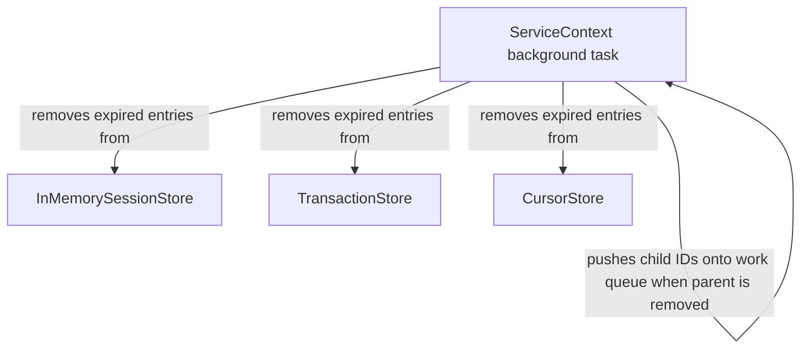

# RFC-0015: Logical Session Management

## Problem

The DocumentDB Gateway lacks direct logical session management. Session context is inferred indirectly from cursor and transaction state rather than tracked explicitly, preventing reliable session ownership and lifecycle enforcement. This causes session-scoped resources to remain open longer than intended, or indefinitely, with no deterministic cleanup path.

### Impact on Applications

Clients that use session-scoped cursors and transactions face three issues:
1. Resources tied to a session may not be cleaned up when the session ends, leading to unexpected behavior and potential resource exhaustion
2. No guarantee that `endSessions` or `killSessions` commands promptly release all associated resources
3. `refreshSessions` cannot be implemented directly.

### Impact on the Gateway

Without direct session tracking, the gateway has three operational problems:
1. Session ownership cannot be verified: a cursor or transaction opened by one user can be accessed by another
2. Cleanup of session-bound resources requires broad O(n) scans across all cursors and transactions rather than O(k) direct lookups per session
3. Resource cleanup relies on ad-hoc, indirect paths that are incomplete and prone to leaks

### Current State

Session IDs are stored as bare fields on `GatewayTransaction` and `CursorStoreEntry` with no dedicated structure to track session lifetime or provide direct mechanisms for lifecycle management:

[pg_documentdb_gw/documentdb_gateway_core/src/context/transaction.rs](https://github.com/documentdb/documentdb/blob/d4840e60f5049212a2de7d490eb7e5060a252d65/pg_documentdb_gw/documentdb_gateway_core/src/context/transaction.rs)
```rust
pub struct GatewayTransaction {
    pub session_id: Vec<u8>,
    pub transaction_number: i64,
    pub cursors: CursorStore,
    pg_transaction: Option<postgres::Transaction>,
}
```

[pg_documentdb_gw/documentdb_gateway_core/src/context/cursor.rs](https://github.com/documentdb/documentdb/blob/d4840e60f5049212a2de7d490eb7e5060a252d65/pg_documentdb_gw/documentdb_gateway_core/src/context/cursor.rs)

```rust
#[derive(Debug)]
pub struct CursorStoreEntry {
    pub conn: Option<Arc<Connection>>,
    pub cursor: Cursor,
    pub db: String,
    pub collection: String,
    pub timestamp: Instant,
    pub cursor_timeout: Duration,
    pub session_id: Option<Vec<u8>>,
}
```

Sessions are partially implicit. There is not a `LogicalSession` entity that owns or tracks the cursors and transactions associated with it. A session only "exists" on the server insofar as there are active cursors or transactions carrying that session ID. The gateway has no independent record of when the session was created, when it was last used, or what resources belong to it. This makes it impossible to enforce session expiry, validate ownership, or perform direct cleanup without scanning all cursors and transactions.

### Success Metrics

This RFC MUST achieve:
1. Sessions are explicitly associated with their cursors and transactions at creation time
2. Session ownership is validated on all session-scoped operations
3. `endSessions` and `killSessions` achieve O(k) cleanup per session rather than O(n) scans
   - k represents the total count of transactions and cursors owned by a given session. 
   - n represents the total count of all transactions and cursors across all sessions.
4. `refreshSessions` MUST reset the timeout duration of the session to allow for long running sessions.
5. Session termination (whether via `endSessions`, `killSessions`, or idle timeout expiry) cascades cleanup of all associated cursors and transactions deterministically.
6. Sessions expire after 30 minutes of idle time, consistent with `localLogicalSessionTimeoutMinutes`.
7. Implicit session creation is still supported
8. `startSession` command is supported
9. User ownership is enforced over Sessions, Cursors and Transactions.

### Non-Goals

This RFC explicitly does NOT:
- Implement support for `$listSessions` or `$listLocalSessions`

---

## Approach

The proposed solution is to introduce `LogicalSession` as a first-class entity in the gateway, backed by a new `InMemorySessionStore` that owns the mapping from a session ID to its associated transactions and cursors. This gives the gateway an authoritative, independently queryable record of every active session, including its creation time, last-used timestamp, and the set of resource IDs it owns.

### Core Ideas

**1. InMemorySessionStore as the authority for session state**

A new `InMemorySessionStore` will be introduced alongside the existing `TransactionStore` and `CursorStore`. At the point a session-scoped resource is created, it is registered in `InMemorySessionStore`, which records the session ID, creation timestamp, and the IDs of all child transactions and cursors. This eliminates the need to scan child stores to answer "what belongs to this session?".

**2. Top-down cascading cleanup**

Cleanup flows strictly in one direction: `InMemorySessionStore` → `TransactionStore` → `CursorStore`. When a session is terminated (via `endSessions`, `killSessions`, idle timeout, or expiry), the `ServiceContext` background task removes it and enqueues its owned transactions and cursors for cleanup. Stores do not reference each other. This parent-owns-children model makes cleanup deterministic and prevents circular dependencies.

**3. Replace the DashMap-based cleanup task with a non-locking `CacheMap`**

The existing per-store cleanup task is built on DashMap, a locking structure that creates thread contention under high concurrency. A new `CacheMap` structure, backed by `papaya::HashMap`, will be implemented and used as the foundation for all three stores (session, transaction, and cursor). `CacheMap` provides consistent TTL enforcement without locking overhead. Cleanup and compaction cycles will run in a new background task owned by `ServiceContext`, replacing the per-store cleanup approach.

**4. Distinct ID types**

Separate newtype wrappers (`SessionId`, `TransactionId`, `CursorId`) will be introduced to prevent accidental confusion of raw identifiers (`Vec<u8>`, `u64`, `i64`) across the codebase, improving type clarity and safety at the call site.

### Key Tradeoffs

| Tradeoff | Benefit | Cost |
|---|---|---|
| Cursor timeouts are independent of session TTL | Prevents resource exhaustion from indefinitely refreshed cursors | Cursors are not refreshed when `refreshSessions` is called |
| Top-down-only cleanup graph | Deterministic cascading, no cycles | Parent metadata may temporarily hold stale child IDs (tolerated, lazily compacted) |
| `CacheMap` backed by `papaya::HashMap` | Uniform TTL and eviction behavior, reduced lock contention | Migration cost to replace existing DashMap-based stores |

### Alignment with Existing Architecture

This approach extends the existing `ServiceContext` pattern: `InMemorySessionStore` is constructed alongside `TransactionStore` and `CursorStore`, with the `ServiceContext` background task holding references to all three and driving cleanup. No changes to the wire protocol or backend (PostgreSQL) are required.

---

## Detailed Design

*This section MAY BE REQUIRED before moving from Proposed to Accepted status. This section MUST be completed and approved to move to Implementing status.*

**Purpose:** Provide comprehensive technical details needed for implementation.

**Complete this section when:** Your solution approach has been validated and you're ready to commit to specific implementation details.

**Guidance:** This is where you get specific. Include enough detail that someone could implement this RFC without having to make major design decisions.

### Technical Details

#### Data Structures

**`LogicalSession`**

A new `LogicalSession` struct will be introduced as a first-class entity. It tracks the session ID, last-used timestamp, and the IDs of all owned cursors and transactions. This is an illustrative sketch; the final field types and layout will be determined during implementation:

```rust
pub struct LogicalSession {
    session_id: SessionId,
    timestamp: AtomicU64,
    cursors: Vec<CursorId>,
    transaction_id: Option<TransactionId>,
}
```

**Distinct ID newtypes**

To prevent accidental misuse of raw identifiers across stores, dedicated newtype wrappers will be introduced:

```rust
pub struct SessionId(Vec<u8>);
pub struct CursorId(u64);
pub struct TransactionId(i64);
```

**`CacheMap`**

A new `CacheMap<K, V>` structure will be implemented, backed by `papaya::HashMap`, to replace the existing DashMap-based stores. `CacheMap` provides:
- Per-entry TTL with configurable expiration type (fixed or sliding)
- On access, if an entry has expired, `None` is returned; the entry is **not** removed at access time
- Physical removal of expired entries is the background task's responsibility
- Non-locking concurrent access suitable for high-throughput request paths

At 1M entries, memory consumption is approximately 117 MB (not including the owned session, cursor, and transaction objects).

**`InMemorySessionStore`**

`InMemorySessionStore` wraps a `CacheMap<SessionId, LogicalSession>`. The stores do not reference each other; cascading cleanup is driven entirely by the `ServiceContext` background task, which holds references to all three stores directly.

#### Resource Binding and Ownership

Resources are bound at creation time and cannot change binding:

| Resource | Binding options |
|---|---|
| Session | Always top-level |
| Transaction | Global, or bound to a session |
| Cursor | Global, transaction-bound, or session-bound |

A session may own at most one active transaction. Starting a new transaction while one is already active aborts the previous transaction if it has not been committed.

#### Timeout Behavior

| Kind | Expiration Type | Refresh on Access | Default Timeout |
|---|---|---|---|
| Session | Fixed | Yes (`refreshSessions` or read/write activity) | 30 minutes |
| Transaction | Fixed | No | 60 seconds (configurable) |
| Cursor (persisted) | Sliding | Yes (on `getMore`) | 60 seconds |
| Cursor (streaming) | Sliding | Yes (on `getMore`) | 10 minutes |

Cursor timeouts are independent of session TTL. `refreshSessions` resets the session timeout only; it does not extend cursor or transaction lifetimes unless `useSessionBoundCursorLifetime` is enabled.

#### Session Lifecycle

A session's lifetime is tracked via a timestamp updated on each activity. There are no explicit state enum variants; liveness is determined entirely by TTL and store membership. A session's TTL is extended when:
- A cursor or transaction is created for it
- `refreshSessions` is called for it

Every resource moves through the following internal states:

```mermaid
stateDiagram-v2
    direction LR
    [*] --> Created : session inserted into store
    Created --> Active : available for lookup
    Active --> EvictionRequested : TTL expiry / endSessions / killSessions / killAllSessions
    EvictionRequested --> RemovedFromIndex : background task processes item
    RemovedFromIndex --> FullyDropped : all live references released
    FullyDropped --> [*]
```



Once a session enters `EvictionRequested`, new lookups will fail but any component already holding a live reference may continue to use it until it is `FullyDropped`.

#### Cleanup Architecture

The `ServiceContext` background task owns references to all three stores and drives eviction entirely on its own. The stores do not reference each other. Eviction paths never perform cleanup inline; instead they push the item onto a cleanup queue and send a non-blocking wake-up signal to the cleanup task.

**Wake-up signal**

A bounded `mpsc` channel with capacity 1 is used as the wake-up signal. When an eviction is enqueued, the eviction path does a non-blocking `try_send(())`. If a signal is already pending, the send is silently dropped. This prevents unbounded signal buildup while still guaranteeing the cleanup task will wake soon.

**Cleanup loop**

After waking on a signal, the cleanup task applies a short debounce window (10–50 ms) to let nearby eviction requests accumulate, then drains any duplicate signals and runs one cleanup pass. A slower periodic fallback timer also ticks independently, so the system remains self-healing if a signal is ever missed. This hybrid model keeps latency low under normal load and prevents thrashing under bursts of expirations.

The cleanup task drains the cleanup queue iteratively (never recursively), breadth-first. When it removes a session it pushes the session's owned transaction and cursor IDs back onto the work queue; when it removes a transaction it pushes its cursor IDs. All three stores are processed in a single loop:



Child stores never reference parent stores. Cascading cleanup is the cleanup task's responsibility, not the stores'. Duplicate eviction requests are safe; removal is idempotent. Parent stores may temporarily retain stale child IDs, which are tolerated and lazily compacted on the next cleanup pass.

#### Session Limits and LRU Eviction

The number of active sessions is capped at `maxLogicalSessions` (default 1,000,000). When the cap is reached, the least-recently-used session is evicted to make room for new sessions. Telemetry will be emitted when LRU eviction occurs.

### API Changes

The following gateway commands will be added or modified:

| Command | Status | Behavior |
|---|---|---|
| `startSession` | New | Creates a `LogicalSession` entry in `InMemorySessionStore` and returns the assigned `SessionId`. Supports both explicit and implicit session creation. |
| `refreshSessions` | New | Resets the TTL of the specified session(s). Does not refresh associated cursors or transactions. Tracked in [#425](https://github.com/documentdb/documentdb/issues/425). |
| `endSessions` | Modified | Marks the specified session(s) as expired. The session is not immediately removed; the `ServiceContext` cleanup task processes the eviction asynchronously and cascades cleanup to owned transactions and cursors. |
| `killSessions` | Existing | Immediately removes the specified session(s) and enqueues cascading cleanup of all owned transactions and cursors. |
| `killAllSessions` | Existing | Immediately removes all active sessions and enqueues cascading cleanup of all owned resources. |

**Breaking changes:** None. Implicit session handling (commands that carry a session ID without a prior `startSession`) continues to be supported. A `LogicalSession` is created on first use if one does not already exist.

### Database Schema Changes
*Not applicable*

### Configuration Changes

The following settings will be introduced:

| Setting | Type | Default | Description |
|---|---|---|---|
| `logicalSessionTimeoutInSeconds` | `int` | `1800` | Maximum number of seconds a session remains valid without being used or refreshed. |
| `maxLogicalSessions` | `int` | `1000000` | Maximum number of concurrently active sessions. When the cap is reached, the least-recently-used session is evicted. |
| `useSessionBoundCursorLifetime` | `bool` | `false` | When enabled, cursor lifetime is tied to the owning session, meaning refreshing the session also refreshes its cursors. Disabled by default to prevent resource exhaustion. |
| `resourceCleanupIntervalInSeconds` | `int` | `60` | Interval at which the background cleanup task scans stores for expired sessions, transactions, and cursors. Explicit cleanup triggers an immediate pass with a minimum 5-second debounce between invocations. |

### Testing Strategy

*Describe how this will be tested*
- Unit test approach
- Integration test requirements
- Compatibility test requirements
- Performance test plans
- Migration test strategy

### Migration Path
*Not applicable*

### Documentation Updates

*What documentation needs to change?*
- User-facing docs
- Developer guides
- API references
- Examples/tutorials

---

## Implementation Tracking

*This section SHALL be populated during the Implementation phase.*

**Purpose:** Track the implementation progress of this RFC.

**Complete this section when:** Your RFC has been accepted and implementation work begins.

**Guidance:**
- Link to the PRs that implement this RFC. Update as implementation progresses.
- Provide success metrics.

### Implementation PRs

- [ ] PR #XXX: [Brief description of what this PR implements]
- [ ] PR #XXX: [Brief description of what this PR implements]
- [ ] PR #XXX: [Brief description of what this PR implements]

### Status Updates

*Add dated status updates as implementation progresses*

**YYYY-MM-DD:** Initial implementation started in PR #XXX

**YYYY-MM-DD:** [Update on progress, blockers, or changes]

### Open Questions

*Track unresolved questions that arise during implementation*

- [ ] Question: [Description]
  - Discussion: [Link to discussion or resolution]

### Implementation Notes

- **Decision [2026-04-01]:** Cursor timeout will not be refreshed when `refreshSessions` is called unless a configuration value, `useSessionBoundCursorLifetime` is set to true.
  - **Context:** Cursors currently consume a backend connection, tying the lifetime of the cursor to the session could lead to accidentally exhausting backend resources.
  - **Alternatives:** 
    - Decoupling completely without the ability to tie the lifetimes together
    - Binding cursor lifetime to a session lifetime.

- **Decision [2026-03-24]:** DashMap will be removed in favor of papaya::HashMap
  - **Context:** DashMap introduces additional contention with concurrent readers when iterating over and removing elements. This is observed even while iterating using shards with the `raw-api` featuer enabled.
  - **Alternatives:** 
    - Keep DashMap
    - Implement a custom data structure at the cost of additonal maintenance
